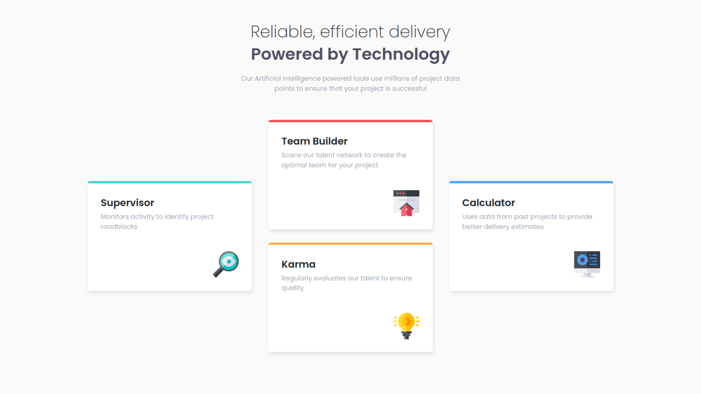

# Four card feature section solution

This is a solution to the [Four card feature section challenge on Frontend Mentor](https://www.frontendmentor.io/challenges/four-card-feature-section-weK1eFYK). Frontend Mentor challenges help you improve your coding skills by building realistic projects. 

## Overview

### The challenge

Users should be able to:

- View the optimal layout for the site depending on their device's screen size

### Screenshot

### Links

- Solution URL: [github.com/migueweb/four-card-feature-section](https://github.com/migueweb/four-card-feature-section)
- Live Site URL: [migueweb.github.io/four-card-feature-section](https://migueweb.github.io/four-card-feature-section)

## My process

### Built with

- Semantic HTML5 markup
- Sass
- Bootstrap
- Mobile-first workflow

## Author
Miguel Amador
- Github - [@migueweb](https://github.com/migueweb)
- Frontend Mentor - [@migueweb](https://www.frontendmentor.io/profile/migueweb)

